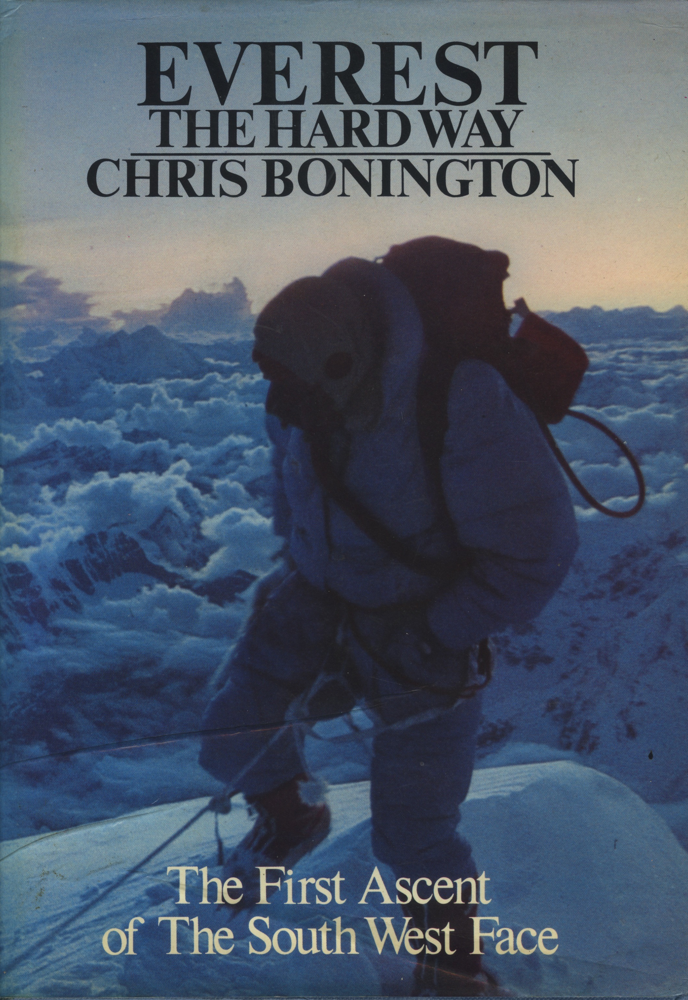

Besieging Everest
=================


[](https://en.wikipedia.org/wiki/Mount_Everest)

This repository announces a [coding competition](competition.md) in the [q programming language](https://code.kx.com) for the benefit of [Community Action Nepal](https://canepal.org.uk).


Background
----------
The [1975 British Everest Expedition](https://en.wikipedia.org/wiki/1975_British_Mount_Everest_Southwest_Face_expedition#Preparations) set out to climb the biggest mountain in the world by its hardest route, the South West Face. It was among the last of the ‘siege’ expeditions, with 18 climbers, 60 porters, and 24 tons of equipment. It was led by [Chris Bonington](https://www.bonington.com/), a former army officer, who used a computer program to help plan the formidable logistics. 

His logistics worked. The expedition put (at that time) more climbers on the summit, by the hardest route, and in the shortest time. 

The computer program was written in APL, the ancestor language of q. It was my first solo software project. Chris would have liked a program that planned the logistics, but writing that was beyond me. Instead I wrote a program that represented the logistics state. Chris did the hard work of generating movement orders, and we used the program together through the winter of 1974-5 to explore the problem space. 

In outline the problem is simple. The final assault on the summit would be made by two climbers from the highest of seven camps: Base Camp and Camps 1-6. (Like coders, mountaineers start counting at zero.) Establishing two climbers at Camp 6 meant building a supply line that would pass upwards food, fuel, gear and oxygen cylinders while also consuming them. The supply chain had to be able to sit out days of bad weather, but the whole thing had to be done in a few weeks between the monsoon and the winter storms. 

The original program was about 150 lines of Sigma APL code, mercifully long vanished. But in later years, as I gained experience as a developer, I wondered what it would take to write the program that Chris wanted. And I kept my copy of _Everest The Hard Way_, the book Chris wrote about the expedition, with its appendices full of plans, charts and tables. 



<br>
<small>_Everest The Hard Way_, and route to the summit</small>


2020
----
This repo contains the first steps towards a full solution, written in the [q programming language](https://code.kx.com/). 

Tables in q represent the expedition state handily, leaving one free to concentrate on generating movement orders. 
The script [`swf.q`](swf.q) is already considerably more ambitious than its 1974 ancestor, and manages to stumble through the first few days of expedition time.

The script represents the lead climbing party making a route to the next camp.
The function `day` advances the clock one day and returns the new state.

```q
❯ q swf.q
KDB+ 4.0 2020.08.03 Copyright (C) 1993-2020 Kx Systems
m64/ 12()core 65536MB sjt mackenzie.local 127.0.0.1 EXPIRE 2021.05.27 stephen@kx.com #59875

"Logistics, British Everest Expedition, 1975"
q)day S
climbers haps porters sleep tent food gear o2
----------------------------------------------
18       26   34      50    3098 3734 915  888
0        0    0       0     0    0    153  0
0        0    0       0     0    0    0    0
0        0    0       0     0    0    0    0
0        0    0       0     0    0    0    0
0        0    0       0     0    0    0    0
0        0    0       0     0    0    0    0
```

Above, on the first day, climbers made 1/3 of the route from Base Camp to Camp 1. 

The next development step is movement orders to bring climbers and porters up behind them. 

An implicit challenge is to retain the array-programming style, avoiding loops and other control structures. 

The Scan and Over iterators suffice to cycle through the days of expedition time.

```q
q)5 day/S
climbers haps porters sleep tent food gear o2
----------------------------------------------
14       26   34      50    346  416  68   100
4        0    0       20    2752 3258 954  788
0        0    0       0     0    0    46   0
0        0    0       0     0    0    0    0
0        0    0       0     0    0    0    0
0        0    0       0     0    0    0    0
0        0    0       0     0    0    0    0
```


Community Action Nepal
----------------------

Please consider making a donation to [Community Action Nepal](https://www.canepal.org.uk/)


Contact
-------

Stephen Taylor [stephen@kx.com](mailto:stephen@kx.com)

